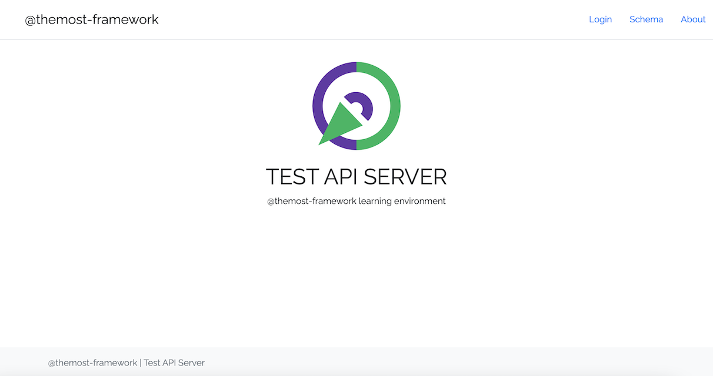

 

## @themost/test
[@themost-framework](https://github.com/themost-framework) Test API Server

### Installation

        npm i @themost/test
        
### Usage

Start a standalone instance of test api server:

        npx @themost/test [--port <port>] [--host <host>]

Get a bearer token using `password grant` flow (read more at https://www.oauth.com/oauth2-servers/access-tokens/password-grant/)

    curl --location 'http://localhost:3000/auth/token' \
    --header 'Content-Type: application/x-www-form-urlencoded' \
    --data-urlencode 'client_id=9165351833584149' \
    --data-urlencode 'client_secret=hTgqFBUhCfHs/quf/wnoB_UpDSfUusKA' \
    --data-urlencode 'username=alexis.rees@example.com' \
    --data-urlencode 'password=secret' \
    --data-urlencode 'grant_type=password' \
    --data-urlencode 'scope=profile'

>   
    {
      "access_token": "<access token>",
      "token_type": "bearer",
      "expires_in": 3600,
      "scope": "profile"
    }

and start making requests for getting data from test api server by using OData v4 protocol 
(read more at http://docs.oasis-open.org/odata/odata/v4.01/odata-v4.01-part2-url-conventions.html)

e.g. get products

    curl --location 'http://localhost:3000/api/Products?%24select=category%2Cprice%2Cmodel%2CreleaseDate%2Cname' \
    --header 'Authorization: Bearer <access token>'

with response:

    {
      "value": [
        {
            "category": "Laptops",
            "price": 444.76,
            "model": "SR2155",
            "releaseDate": "2019-04-21T16:43:59.000Z",
            "name": "Apple MacBook Air (13.3-inch, 2013 Version)"
        },
        {
            "category": "Laptops",
            "price": 357.84,
            "model": "LD1737",
            "releaseDate": "2019-01-14T08:49:33.000Z",
            "name": "Apple MacBook Pro With Retina Display (15-inch, 2013 Version)"
        }
        ...
      ]
    }

or create a jasmine test spec and start testing api server

        import { getApplication, serveApplication, getServerAddress } from "@themost/test";
        import fetch from "node-fetch";
        describe("TestApi", () => {
          let server;
          let server_uri;
          beforeAll(done => {
            const app = getApplication()
            serveApplication(app)
              .then(liveServer => {
                server = liveServer;
                server_uri = getServerAddress(server);
                return done();
              })
              .catch(err => {
                return done(err);
              });
          });
          afterAll(done => {
            if (server) {
              server.close(() => {
                return done();
              });
            }
          });
          it("should access server", async () => {
            expect(server).toBeTruthy();
            const response = await fetch(new URL("/", server_uri));
            expect(response.ok).toBeTruthy();
          });
        });

#### Karma Testing

Test api server may be used alongside with [karma](https://github.com/karma-runner/karma) for testing.

Create karma-test-api-server.js:

    // karma-test-api-server.js
    const {getApplication, serveApplication, getServerAddress} = require('@themost/test');
    const { URL } = require('url');
    function serveKarmaTestApiServer(proxies) {
        const app = getApplication();
        return serveApplication(app).then( function(liveServer) {
            const serverAddress = getServerAddress(liveServer);
            Object.assign(proxies, {
                '/api/': new URL('/api/', serverAddress).toString(),
                '/auth/': new URL('/auth/', serverAddress).toString()
            });
        });
    }
    
    serveKarmaTestApiServer.$inject = ['config.proxies'];
    
    module.exports =  {
        'framework:api': [
            'factory',
            serveKarmaTestApiServer
        ]
    };

and modify karma.conf.js to include test api server

    // karma.conf.js
    module.exports = function (config) {
      config.set({
        basePath: '',
        frameworks: [..., ..., 'api'],
        plugins: [
          require('./karma-test-api-server'),
          ...
        ],
        client: {
          clearContext: false
        }
        ...
        
